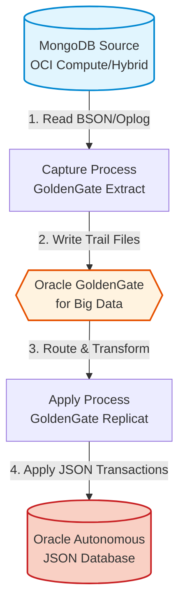

# MongoDB to Oracle Autonomous JSON Migration (PoC)

## Overview
This architectural framework demonstrates the technical migration path for moving legacy MongoDB database workloads to Oracle Autonomous JSON Database (AJD). This solution ensures high availability and near-zero downtime using Oracle GoldenGate for real-time data replication.

## Architecture

## Key Architecture Components
* **Source:** MongoDB running on OCI Compute / Hybrid Cloud
* **Target:** Oracle Autonomous JSON Database (AJD)
* **Replication Layer:** Oracle GoldenGate for Big Data

## Migration Strategy
1. **Schema Mapping:** Mapping BSON structures to Oracle JSON document store specifications.
2. **Connectivity:** Establishing secure, low-latency cross-platform connectivity between source and target environments.
3. **Replication Workflow:** Configuring GoldenGate to capture DML changes from the source MongoDB instances.
4. **Validation:** Executing automated consistency checks to validate data integrity between the MongoDB source and the Autonomous JSON target.

## Technical Value
* **Efficiency:** Utilizing OCI-native replication to minimize manual intervention.
* **Scalability:** Transitioning to Autonomous Database enables self-patching, self-tuning, and self-scaling capabilities.
* **Reduced Downtime:** Leveraging GoldenGate to maintain operational continuity during the translocation process.

---
*Created by Mohamed Mousa | Lead Cloud Architect*
